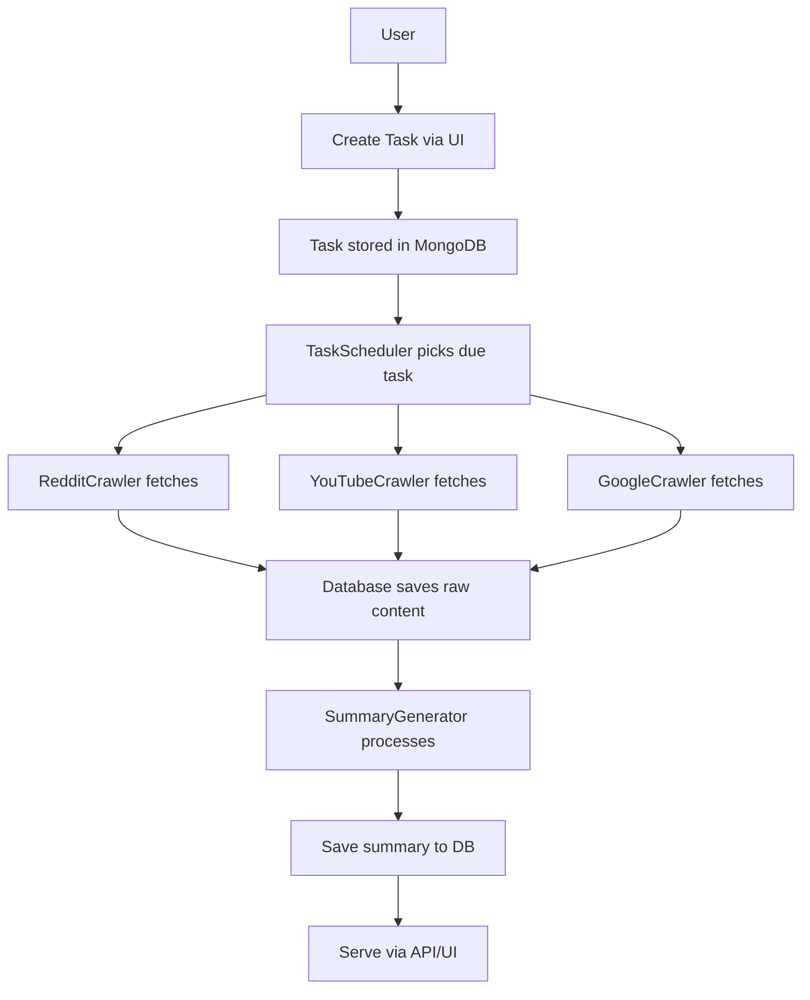

# 🔁 Development Workflow

## 1. Feature Tracking

- [ ] Replace hardcoded YouTube IDs with real search support (via better API or custom parsing)
- [ ] Add frontend dashboard for summaries
- [ ] Improve error handling for summarization failures
- [ ] Deploy on Render/Vercel/EC2
- [ ] Add user login system

## 2. Current MVP Flow

## 3. Branching Strategy

- `main`: stable prod-ready code
- `v1-mvp-working`: current MVP
- `dev`: work-in-progress feature branches
