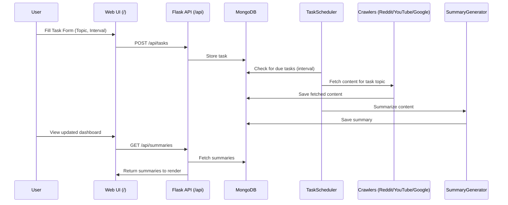

# 🔄 Request Flow & Architecture

This note shows how the system processes a user request, step-by-step.

## 🔁 System Request Flow (End-to-End)

## 🧱 Components Breakdown

- [[README]]
- [[Architecture]]
- [[Development Flow]]
- [[API Endpoints]]
- [[Notes and Issues]]

---
➡ Return to [[README]]
